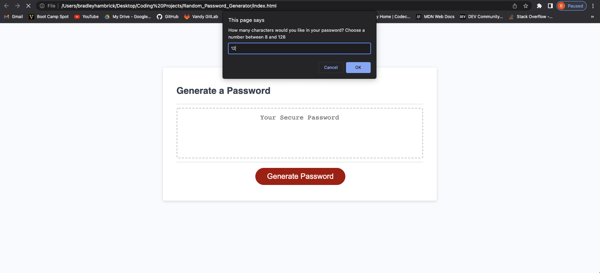
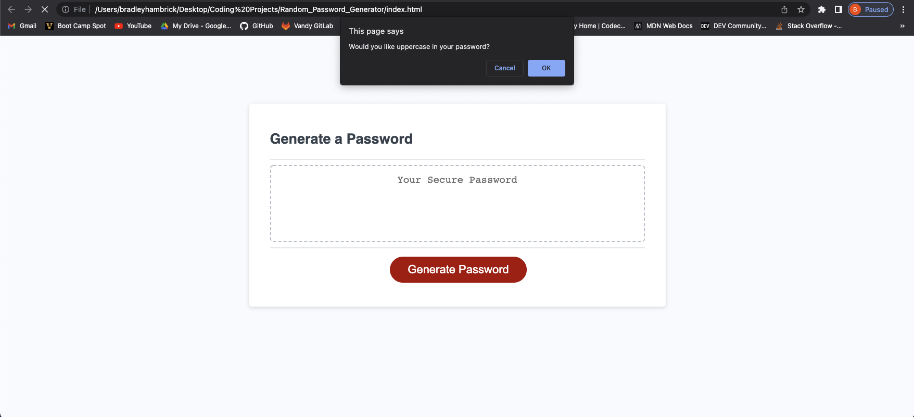

# Random_Password_Generator

## Deployed Application

## Description
This project was completed in order to provide users with a means of generating a random password that meets their own personal preference of criteria.

## Badges
There are no images that require licensing and all the coding methods were those taught in the Vanderbilt Web Development Boot Camp.

## Visuals

## Usage
This project will be used to create random passwords based upon a selected criteria

## Support
For support, contact Brad Hambrick @bradleyhambrick@gmail.com

## Roadmap
This project is a basic tool however there may be additional CSS styling in order to make it more visually appealing.  

## Contributing
This project is open to recommendations and future contributions.

## Authors and acknowledgment
Thanks to Vanderbilt Coding Bootcamp for contributing to the knowledge required to build this project.

## License
N/A 

## Project status
The project is completed to a point of being operational, however additional features may be added in the future.  

